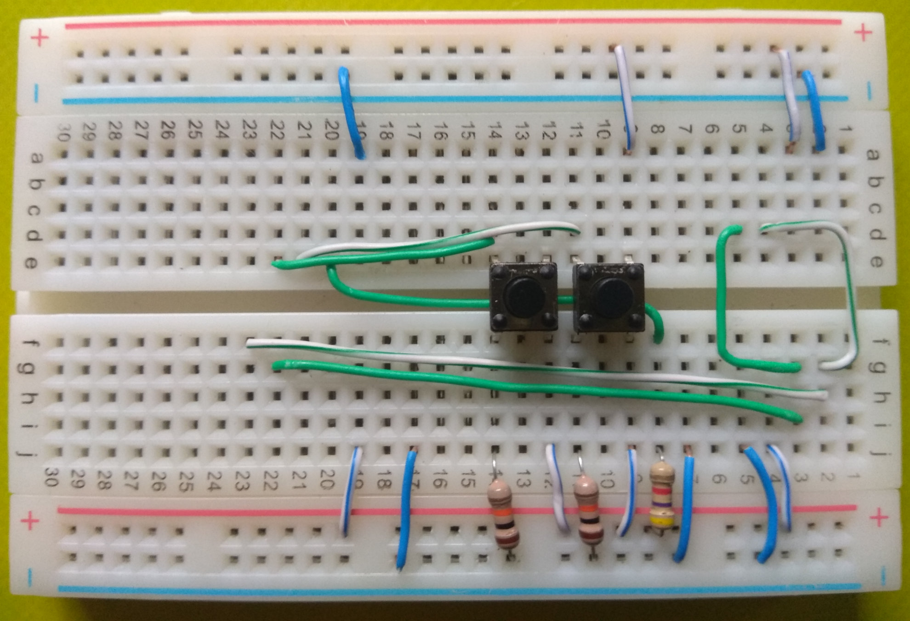

# Arduino Clock and Termometer
# Часы с термометром под управлением Arduino

## Сборка

#### Для сборки такого устройства нам понадобится:

- Плата **Arduino** (любая)
- Модуль часов реального времени (**RTC**)
  (с батарейкой)
- Экран. Можно использовать монохромный **OLED**
  или текстовый **16x2**. В данной схеме я
  использую экраны с интерфейсом *I2C*, если у
  вас дисплей с другим подключением, посмотрите
  в интернете что необходимо для его подключения.
- Два термодатчика **DS18B20**. Один датчик для
  замера наружной температуры, другой для замера
  комнатной температуры, но можно использовать
  только 1, а можно и совсем без датчиков
  температуры, просто отображать время.
- Две **кнопки**
- Два **резистора 10kOm** для кнопок
- **Резистор 4.7kOm** для термодатчика
- Соединительные **провода**
- Монтажная плата (**Breadboard**) (Можно
  обойтись без монтажной платы соединив только
  проводами, это на ваше усмотрение и в зависимости
  от конструкции которую вы придумали)


#### Схема сборки

Привожу 2 схемы подключения, они одинаковые, просто
выберите по какой вам удобнее ориентироваться.


***Примечание:*** Если у вас есть резисторы, но не того
номинала, можно их группировать для получения нужного.
Например, мне нужен был резистор на 4.7 kOm, но были
резисторы только с сопротивлением 1 kOm и 10 kOm.
Для получения сопротивления 4.7 kOm я включил
параллельно два резистора по 10 kOm, получилось общее
сопротивление 5 kOm что с учетом погрешности
резисторов - нормально.

#### Примеры устройств

Вот первый вариант устройства которое я собрал
для проверки подключения всех компонентов:


Второе устройство собирал уже как готовое
к использованию устройство. Вот оно на разных
этапах сборки:


Третье устройство с *OLED* экраном:



## Программа

Настройки программы вы можете сделать в файле
***Settings.h***

#### Выбор подключенного дисплея
Если вы в устройстве используете текстовый дисплей *16x2*,
раскомментируйте строку (уберите символы // вначале строки):
```objectivec
#define ATC_DISPLAY_TEXT 1
```
Если вы используете *OLED* дисплей, раскомментируйте строку:
```objectivec
#define ATC_DISPLAY_GRAPH 1
```
Из этих двух строк раскомментируйте только одну,
в зависимости от используемого дисплея. Если оставить
закомментироваными обе строки, то показания времени
и температуры будут передаваться в серийный порт.
(Если вы не уверены в том что какой-то из компонентов
подключен правильно, вы можете воспользоваться этим
режимом для тестирования)

#### Сохранение режима при переключении
При запуске устройство переходит в режим работы
по умолчанию, позже его можно переключить кнопками.
Для того чтобы при включении устройства использовался
последний выбраный режим, можно раскомментировать строку:
```objectivec
#define ATC_USE_EEPROM_ADDR 10
```
При этом настройки режима будут сохраняться в памяти
**EEPROM**. Поскольку эта память имеет ограниченное
количество операций записи в одну и ту же ячейку,
я рекомендую включить сохранение режима после того
как в вы уже соберете окончательную версию устройства,
попереключаете режимы, понастраиваете их отображение
(если у вас есть такая потребность и возможность).
Ну, а если появятся какие-то проблемы при сохранении
выбранного режима, можете изменить номер ячейки
в которой хранится значение, только учитывайте что
для хранения режима используются 2 ячейки (например:
при значении 10 используются 10 и 11 ячейки)

#### Настройка используемых пинов
В этом устройстве используются такие выходы **Arduino**:
- A4 (SDA) и A5 (SCL) - эти выходы нет возможности
заменить на другие, поскольку они используют аппаратные
возможности микросхемы
- 2 - для подключения термодатчиков (можно заменить
на любой другой)
- 3 - для подключения кнопки **1** (можно заменить
на любой другой)
- 4 - для подключения кнопки **2** (можно заменить
на любой другой)

Если вы подключаете термометр и кнопки к другим
выходам **Arduino**, то сделайте соответствующие
изменения в файле настроек в строках:
```objectivec
#define ATC_PIN_TERMO 2  // Specify pin for Temperature sensor

#define ATC_PIN_KEY1  3  // Specify pin for button 1
#define ATC_PIN_KEY2  4  // Specify pin for button 2
```

## Руководство пользования

Это устройство имеет 2 кнопки:
- ***1*** - та которая подключена к контакту *3*
- ***2*** - та которая подключена к контакту *4*

#### Переключение режима
Нажмите и удерживайте кнопку **2** для переключения
режима отображения информации на дисплее. В устройстве
с текстовым дисплеем режимы такие:
- Температура с точностью до **тысячных** и в дате год **двухзначный**
- Температура с точностью до **десятых** и в дате год **четырехзначный**

В устройстве с графическим дисплеем режимы такие:
- Температура **бОльшими** цифрами с точностью до **сотых**,
время на **круглых** часах
- Температура **меньшими** цифрами с точностью до **тысячных**,
время **цифрами**

***Примечание:*** Хотя на дисплее отображаются десятые,
сотые или тысячные доли градусов температуры, реальный
шаг измерения показаний температуры не достигает такой
точности. Но при режиме отображении тысячных долей
градуса, точность снимаемых показаний выше чем при
десятых или сотых, но и частота обновления экрана
немного ниже, за счет увеличения времени на опрос
датчиков температуры.

#### Поменять местами значения температуры
Нажмите и удерживайте **две кнопки** одновременно.
Если вы считаете что логически правильно чтобы
уличная температура отображалась верхним числом,
а комнатная нижним или для вас удобнее воспринимать
наоборот комнатную сверху, уличную снизу, вы можете
переключить отображение значений температуры по своему.

#### Настройка часов
Нажмите и удерживайте кнопку **1**, вы перейдете
в режим настройки часов, при этом будут мигать
показания секунд. Если при этом нажать кнопку **2**
значение секунд сбросится в *00*. Последующими
нажатиями кнопки **1** вы переключаете настройку на
*минуты* -> *часы* -> *дни* -> *месяцы* -> *годы*,
соответствующие показания будут мигать. При этом
вы можете изменять эти значения нажатием кнопки **2**.
Нажатием кнопки **1** при настройке показаний *годов*
вы выходите из режима редактирования часов. Можно
завершить настройку часов нажатием и удерживанием
кнопки **1**. Так же если в режиме настройки часов некоторое время
не нажимать кнопки, произойдет автоматический выход
из этого режима.
